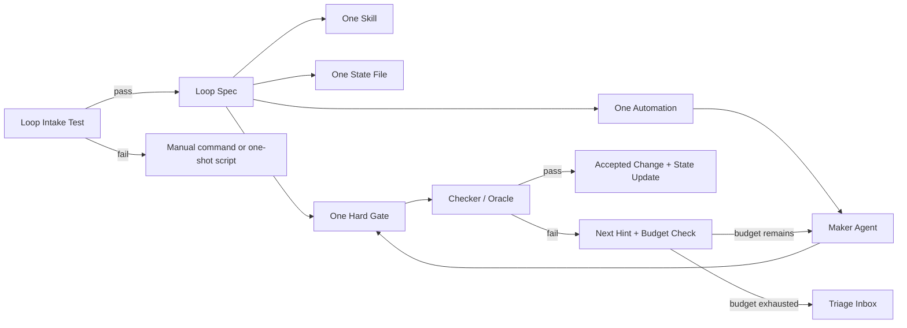

# Loop Engineering Support Design

Status: proposed
Owner: tech-lead
Updated: 2026-06-30

## Goal

Make Team Skills Platform support loop engineering as a first-class runtime pattern instead of a set of Claude-specific command notes.

The design follows the referenced X article and Addy Osmani's loop engineering framing:

- do not build a loop unless the work repeats, has automated verification, has an explicit budget, and has enough tool access to act like a senior engineer
- start with the minimum viable loop: one automation, one skill, one state file, one hard gate
- split maker and checker so the agent that writes does not certify its own work
- persist state outside the conversation so scheduled runs resume instead of restarting
- treat unattended loops as budget, permission, comprehension, and security risk

## Current State

TSP already has useful loop primitives, but they are not yet a coherent platform layer.

| Area | Existing files | Gap |
|------|----------------|-----|
| Goal loop | `commands/goal.md`, `scripts/lib/completion-oracle.js`, `skills/goal-convergence/SKILL.md` | State is hard-coded to `~/.claude/goals`; command is not connected to install targets or workflow readiness |
| Discovery loop | `commands/heartbeat.md`, `skills/loop-heartbeat/SKILL.md`, `scripts/lib/heartbeat-scheduler.js` | Reads `.claude/heartbeat.yaml`; scheduling contract assumes Claude primitives |
| Triage | `commands/triage.md`, heartbeat triage JSONL writes | Inbox path is Claude-specific and not exposed as a reusable state-store API |
| Resume | `scripts/hooks/session-start-goal-resume.js` | Hook reads only Claude goal state and does not participate in Codex/OpenCode installs |
| Skills | `skills/verification-loop`, `skills/continuous-learning-v2`, `skills/context-engineering`, `skills/context-lifecycle`, `skills/session-continuity` | Skills exist separately; no "loop-engineering" pack explains when to combine them |
| Install surface | `manifests/install-modules.json`, `manifests/install-components.json` | Loop commands/scripts are not modeled as one installable capability module |

The new design should preserve these primitives, but move their shared assumptions into a target-neutral runtime.

## Design Decision

Introduce a `loop-engineering` capability pack with a target-neutral state and execution contract.

The pack is not a new role and not a replacement for `/team-*`. It is a runtime pattern that `/team-*`, specialist commands, and scheduled jobs can use when a task passes the loop intake test.



## Target Architecture

### 1. Loop Intake Contract

Add a shared intake decision used by `/loop-start`, `/goal`, `/heartbeat`, and future Codex automations.

Required fields:

```json
{
  "taskRepeats": true,
  "automatedVerification": ["npm test", "npm run build"],
  "budget": {
    "maxIterations": 10,
    "maxDuration": "2h",
    "maxDollars": 5
  },
  "toolAccess": {
    "read": true,
    "write": true,
    "git": true,
    "externalConnectors": ["github"]
  },
  "humanReviewRequired": true
}
```

Blocking rule: if any of `taskRepeats`, `automatedVerification`, `budget`, or `toolAccess` is missing, the command must refuse scheduled loop setup and recommend a one-shot `/quick`, `/verify`, or manual script path.

### 2. Target-Neutral Loop State

Create `scripts/lib/loop-state-store.js` and stop writing directly to `~/.claude`.

State resolution order:

1. `TSP_LOOP_STATE_DIR`
2. project local `.tsp/loops/`
3. target adapter default:
   - Claude: `~/.claude/loops/`
   - Codex: `~/.codex/loops/`
   - OpenCode: `~/.config/opencode/loops/`
   - Cangming/CodeWhale/CodeBuddy: adapter-owned config dir

State files:

| File | Purpose |
|------|---------|
| `goals/{goalId}.json` | goal objective, stopping conditions, budget, iterations, oracle verdicts |
| `triage/inbox.jsonl` | findings that need human decision |
| `heartbeat/{loopId}.json` | last run, next run hint, scan results, budget usage |
| `state/{loopId}.md` | human-readable loop state: done, next, blockers, stop conditions |

The Markdown state file is intentionally duplicated with JSON state. JSON drives automation; Markdown lets humans review and understand what the loop is doing.

### 3. Loop Spec Schema

Add `schemas/loop-spec.schema.json` and support `.tsp/loop.yaml`.

Minimum spec:

```yaml
loop:
  id: ci-triage
  description: Keep CI failures triaged and fix machine-checkable failures.
  cadence: 30m
  skill: loop-ci-triage
  stateFile: .tsp/loops/state/ci-triage.md
  gates:
    - name: test
      command: npm test
    - name: library-validation
      command: node scripts/validate-library.js
  maker:
    role: backend-engineer
    writeAccess: true
  checker:
    role: qa-engineer
    writeAccess: false
  budget:
    maxIterations: 10
    maxDuration: 2h
    maxDollars: 5
  escalation:
    onBudgetExhausted: triage
    onSecurityFinding: human
```

Hard rule: a loop spec without at least one gate is invalid.

### 4. Command Surface

Keep existing commands, but define their responsibility clearly.

| Command | Responsibility |
|---------|----------------|
| `/loop-start` | Create or validate a loop spec, run the intake test, initialize state, and print the target-specific start command |
| `/loop-status` | Read target-neutral state and summarize active goals, heartbeat, budget, failures, and intervention advice |
| `/goal` | Run until objective conditions pass or budget escalates |
| `/heartbeat` | Discovery-only recurring scans that create goals or triage items |
| `/triage` | Human decision inbox; can promote a finding to `/goal` |

`/team-*` remains the governance chain. Loop commands must write findings back into the same artifact model when they operate on team-owned delivery work.

### 5. Maker / Checker Separation

`completion-oracle.js` should become `scripts/lib/loop-oracle.js` or delegate to it.

Required behavior:

- maker may write files according to the loop spec
- checker is read-only by default
- checker receives objective gate output, not the maker's private reasoning
- checker verdict must include `pass`, `fail`, or `uncertain`
- `uncertain` escalates after a small retry window instead of looping forever

This keeps the verifier from becoming a softer second reviewer. The gate is still the source of truth.

### 6. Automation Adapters

Add a `scripts/lib/loop-automation-adapters/` layer.

| Target | Adapter behavior |
|--------|------------------|
| Codex | Emit app automation instructions or create a thread wakeup when tool support is available |
| Claude | Use existing cron / schedule primitives and hooks |
| OpenCode | Emit CLI-compatible schedule instructions until native scheduling is available |
| GitHub Actions | Optional fallback for loops that must run when the local app is closed |

The adapter does not own loop logic. It only starts the same loop spec on a target.

### 7. Install Pack

Add a `loop-engineering` module to `manifests/install-modules.json`.

Initial paths:

- `commands/goal.md`
- `commands/heartbeat.md`
- `commands/triage.md`
- `commands/loop-start.md`
- `commands/loop-status.md`
- `skills/loop-heartbeat`
- `skills/goal-convergence`
- `skills/rework-loop`
- `skills/autonomous-loops`
- `skills/continuous-agent-loop`
- `skills/verification-loop`
- `skills/context-engineering`
- `skills/context-lifecycle`
- `skills/session-continuity`
- `templates/context-docs`
- `scripts/lib/loop-state-store.js`
- `scripts/lib/loop-oracle.js`
- `scripts/lib/heartbeat-scheduler.js`

Implementation note: full-profile installs already receive `autonomous-loops`,
`continuous-agent-loop`, `verification-loop`, and `session-continuity` through
existing workflow/agentic modules. The first implementation keeps the
`loop-engineering` module focused on unique loop runtime files and avoids
duplicating those skill-copy operations in install plans.

Then add components:

- `capability:loop-engineering`
- `skill:loop-heartbeat`
- `skill:goal-convergence`
- `skill:rework-loop`
- `skill:autonomous-loops`

Default install policy:

- `full`: enabled
- `team`: enabled only for commands and skills, not scheduled hooks
- `minimal`: disabled

### 8. Safety Model

Loop engineering is allowed only inside a bounded safety envelope.

Required safeguards:

- hard gates are command exits, test reports, schema validation, or security scan results
- no auto-merge in the first release
- no loop may broaden its own permissions
- no auto-install of community skills inside a scheduled loop
- all writes must land on a branch or worktree, not directly on protected main
- every loop has a max iteration, wall-clock, and cost budget
- every escalated loop writes a triage item with the last gate output

### 9. Metrics

Track loop value with accepted-change economics, not raw activity.

Required metrics per loop:

| Metric | Meaning |
|--------|---------|
| `acceptedChangeRate` | accepted changes / loop-created changes |
| `costPerAcceptedChange` | total estimated cost / accepted changes |
| `gatePassRate` | gate passes / checker evaluations |
| `humanInterventions` | number of triage or manual stops |
| `reworkIterations` | iterations after first checker fail |

Policy: if accepted-change rate stays below 50 percent for a review window, disable scheduling and require redesign.

## Implementation Plan

### Phase 1: Design Contract and Docs

Files:

- Add `docs/runbooks/loop-engineering-usage.md`
- Add `schemas/loop-spec.schema.json`
- Update `docs/runbooks/command-and-capability-matrix.md`
- Update `docs/runbooks/runtime-capabilities-overview.md`

Validation:

```bash
node scripts/validate-doc-freshness.js
node scripts/validate-file-references.js --strict
```

### Phase 2: State Store Refactor

Files:

- Add `scripts/lib/loop-state-store.js`
- Update `scripts/lib/completion-oracle.js`
- Update `scripts/lib/heartbeat-scheduler.js`
- Update `scripts/hooks/session-start-goal-resume.js`
- Add focused tests under `tests/test_loop_state_store.js`

Acceptance:

- goals, triage, and heartbeat state can be redirected with `TSP_LOOP_STATE_DIR`
- Claude legacy paths continue to work through adapter defaults
- tests do not write to the real home directory

### Phase 3: Loop Spec and Command Readiness

Files:

- Add `.tsp/loop.example.yaml`
- Update `commands/loop-start.md`
- Update `commands/loop-status.md`
- Add `scripts/lib/loop-spec.js`
- Add validation tests

Acceptance:

- invalid loop specs fail with actionable errors
- specs without gates fail
- specs without budgets fail
- specs that fail the four-condition intake are routed to one-shot alternatives

### Phase 4: Install Surface

Files:

- Update `manifests/install-modules.json`
- Update `manifests/install-components.json`
- Update install plan tests for Codex, Claude, OpenCode, Cangming, CodeWhale

Validation:

```bash
node scripts/validate-library.js
node scripts/install-plan.js --profile full --target codex
node scripts/install-plan.js --profile full --target claude
node scripts/install-plan.js --profile full --target opencode
```

### Phase 5: Automation Adapters

Files:

- Add `scripts/lib/loop-automation-adapters/`
- Add target adapter tests
- Update `commands/heartbeat.md`

Acceptance:

- scheduling is target-specific, but loop state and gate evaluation are shared
- no adapter can start a loop without intake, spec, gate, state, and budget

## Migration Notes

Keep compatibility for existing Claude paths for one release:

- `~/.claude/goals` maps to the new goals store
- `~/.claude/triage/inbox.jsonl` maps to the new triage store
- `.claude/heartbeat.yaml` is read as a legacy alias for `.tsp/loop.yaml`

Emit a deprecation warning only when the user invokes loop commands, not on every session start.

## Non-Goals

- Do not build autonomous architecture decision loops.
- Do not auto-merge loop-created PRs.
- Do not make loop engineering the default for every task.
- Do not replace `/team-*` governance with loop commands.
- Do not require external tools like Linear, Jira, or Slack for the first release.

## Open Questions

1. Should project-local `.tsp/loops/` state be committed by default, or should JSON state stay ignored while Markdown state is committed?
2. Should Codex automations be created directly through app tools when available, or should TSP emit instructions until the API is stable?
3. Should the first implementation rename `completion-oracle.js`, or keep the existing filename and add wrappers to reduce churn?
4. What is the first blessed loop template: CI triage, dependency triage, documentation freshness, or release readiness?

## Recommended First Template

Start with a CI triage loop because it best passes the loop intake test:

- repeats frequently
- has objective gates
- can run with bounded permissions
- produces reviewable branches or triage items
- does not require product or architecture judgment

Minimum CI triage bundle:

- skill: `skills/loop-ci-triage/SKILL.md`
- spec: `.tsp/loops/ci-triage.yaml`
- state: `.tsp/loops/state/ci-triage.md`
- gates: `node scripts/validate-library.js`, `node scripts/validate-doc-freshness.js`, `npm test`
- maker: implementation role selected by changed files
- checker: `qa-engineer` or read-only oracle

This gives TSP a working loop that demonstrates the pattern without asking users to trust a broad unattended agent.
