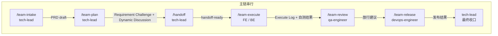
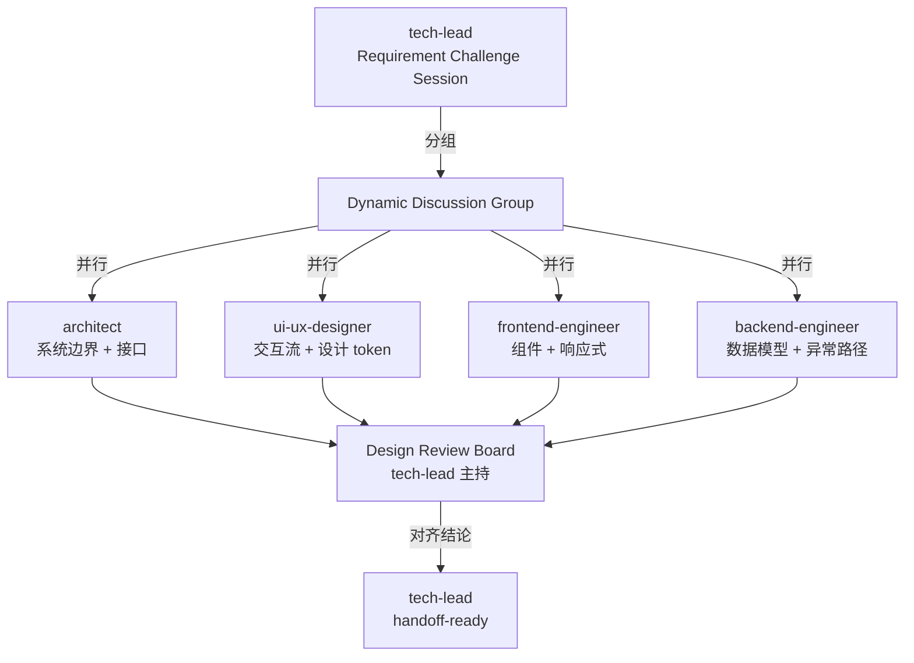
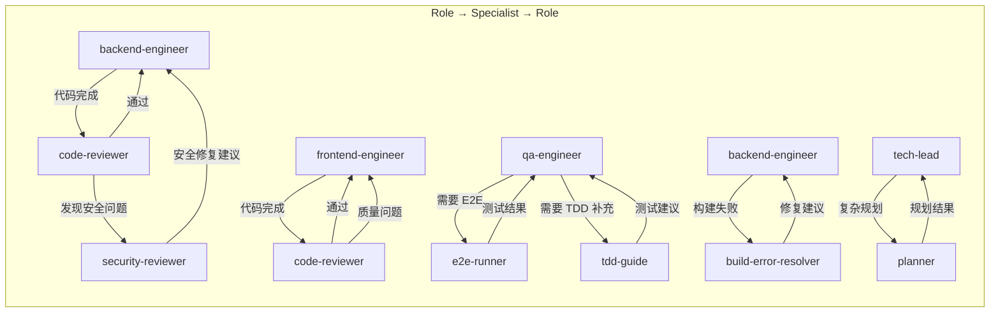
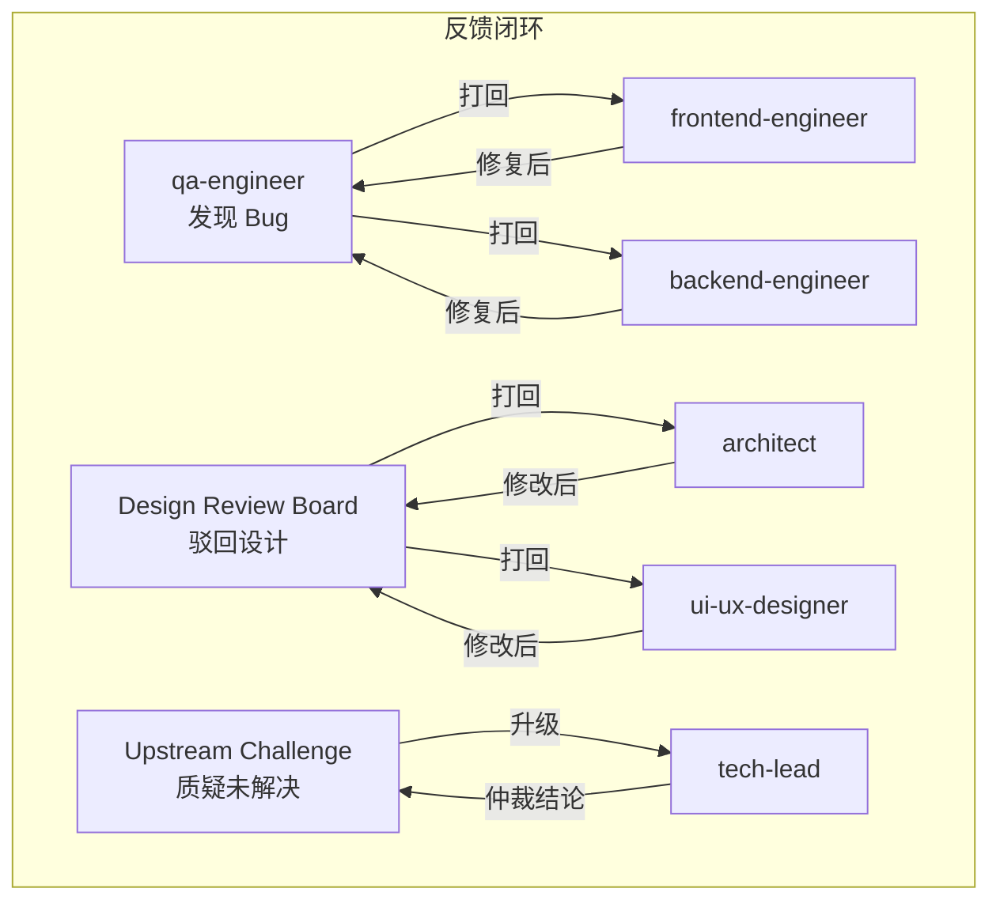
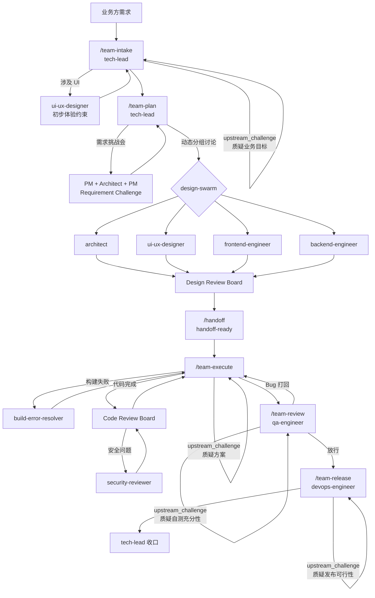

# Handoff 治理文档

本文档是平台全量 Agent 交接路径的可视化治理入口，覆盖主链串行、并行设计、Specialist 调用回路和反馈打回四类路径。

相关文档：
- [sub-agent-invocation-map.md](sub-agent-invocation-map.md) — 命令→Agent 映射
- [agent-governance.md](agent-governance.md) — 统一管控策略
- [handoff-contract.md](../../rules/handoff-contract.md) — 交接字段要求
- [team-command-output-contracts.md](team-command-output-contracts.md) — 命令输出结构

---

## 1. 全量 Handoff 流程图

### 1.1 主链路径（/team-* 串行）

### 1.2 并行设计路径（/team-plan 阶段）

### 1.2.1 动态分组规则

`/team-plan` 不是固定四方并行的默认直通，而是先由 `tech-lead` 按任务特征组装最小讨论组，再决定是否进入并行设计：

- 业务目标或范围不清时，先拉 `product-manager`、`project-manager`、`architect`
- 架构、接口或数据模型变更时，必须拉 `architect`、`backend-engineer`、`project-manager`
- UI 或体验变更时，必须拉 `product-manager`、`ui-ux-designer`、`frontend-engineer`
- 全栈改动时，必须拉 `architect`、`frontend-engineer`、`backend-engineer`、`project-manager`
- 每个参与角色都必须留下至少 1 条质疑记录，否则不得进入 `Design Review Board`

### 1.3 Specialist 调用回路

### 1.4 反馈与打回路径

### 1.5 端到端完整流程

---

## 2. Handoff 矩阵表

### 2.1 Role → Role 交接

| 发送方 | 接收方 | 触发条件 | 必须传递的产物 | 接收方质量门禁 | 常见失败模式 |
|--------|--------|----------|---------------|---------------|-------------|
| `product-manager` | `tech-lead` | PRD 完成 | PRD、用户故事、验收标准、UI/UX 约束摘要 | PRD 有明确的 In/Out Scope 和可测验收标准 | PRD 太模糊，缺少反例分析 |
| `tech-lead` | `architect` | /team-plan 进入 design-swarm | 需求简报、约束、设计方向 | 输入有明确的业务边界和技术约束 | 约束不完整导致方案偏离 |
| `tech-lead` | `ui-ux-designer` | /team-plan 进入 design-swarm（涉及 UI） | PRD、产品类型、目标端、关键页面意图 | PRD 包含 UI 方向说明 | 缺少产品类型和信息密度说明 |
| `tech-lead` | `frontend-engineer` | /team-plan 进入 design-swarm 或 /team-execute | 架构方案、UI/UX Design Spec、设计 token | Design Spec 已通过 Review Board | 设计与架构不对齐 |
| `tech-lead` | `backend-engineer` | /team-plan 进入 design-swarm 或 /team-execute | 架构方案、接口契约、数据模型 | 接口契约有完整的请求/响应/错误定义 | 接口契约不完整或版本冲突 |
| `tech-lead` | `project-manager` | PRD 完成 | PRD、技术约束、资源信息 | 有可排期的任务粒度 | 任务粒度太粗无法排期 |
| `tech-lead` | `qa-engineer` | /team-execute 完成 | PRD、Execute Log、前后端自测结果 | 有可验证的验收标准和自测证据 | 自测不充分，缺少边界态 |
| `tech-lead` | `devops-engineer` | /team-review 放行 | 放行建议、变更清单、配置差异 | 放行建议无阻塞项 | 环境配置遗漏 |
| `architect` | `tech-lead` | 架构设计完成 | ADR、组件拆分、接口约定、风险清单 | 方案可执行且风险已标注 | 过度设计或风险被低估 |
| `ui-ux-designer` | `tech-lead` | Design Spec 完成 | UI/UX Design Spec、设计 token 决策、体验风险清单 | Spec 包含状态定义和响应式策略 | 缺少异常态和边界态设计 |
| `frontend-engineer` | `qa-engineer` | 前端实现完成 | 代码变更、自测结果、UI Review Checklist | 四态（loading/empty/error/success）完整 | 只有成功态，缺少异常态 |
| `backend-engineer` | `qa-engineer` | 后端实现完成 | 代码变更、自测结果、接口实际行为 | 接口契约和实际行为一致 | 接口行为与契约漂移 |
| `qa-engineer` | `tech-lead` | 测试完成 | 测试计划、执行结果、放行建议 | 核心路径全部通过 | 边界态覆盖不足 |
| `qa-engineer` | `frontend-engineer` | Bug 打回 | Bug 描述、复现步骤、期望行为 | Bug 可复现且有明确预期 | Bug 描述模糊 |
| `qa-engineer` | `backend-engineer` | Bug 打回 | Bug 描述、复现步骤、期望行为 | Bug 可复现且有明确预期 | Bug 描述模糊 |
| `devops-engineer` | `tech-lead` | 发布完成 | 发布结果、监控状态、异常项 | 发布成功且监控正常 | 发布后监控缺失 |

### 2.2 Role → Specialist 调用

| 发送方（Role） | 接收方（Specialist） | 触发条件 | 必须传递的产物 | 结论回落 |
|----------------|---------------------|----------|---------------|---------|
| `tech-lead` | `planner` | 复杂需求拆解 | 需求背景、约束 | 回落到 /team-plan 输出 |
| `tech-lead` | `harness-optimizer` | 平台审计 | 当前配置 | 回落到 docs/memory/ |
| `backend-engineer` | `code-reviewer` | 代码完成 | 代码变更 diff | 回落到 Execute Log |
| `backend-engineer` | `build-error-resolver` | 构建失败 | 错误日志 | 回落到 /team-execute |
| `backend-engineer` | `java-build-resolver` | Java 构建失败 | 错误日志 | 回落到 /team-execute |
| `frontend-engineer` | `code-reviewer` | 代码完成 | 代码变更 diff | 回落到 Execute Log |
| `frontend-engineer` | `build-error-resolver` | 构建失败 | 错误日志 | 回落到 /team-execute |
| `qa-engineer` | `tdd-guide` | 测试策略制定 | PRD、代码结构 | 回落到 Test Plan |
| `qa-engineer` | `e2e-runner` | E2E 测试执行 | 测试场景 | 回落到 /team-review |
| `qa-engineer` | `security-reviewer` | 安全相关变更 | 代码变更 | 回落到 /team-review |
| `devops-engineer` | `chief-of-staff` | 跨角色同步 | 发布状态 | 回落到 /team-release |

### 2.3 Specialist → Specialist 级联

| 发送方 | 接收方 | 触发条件 | 常见失败模式 |
|--------|--------|----------|-------------|
| `code-reviewer` | `security-reviewer` | 代码评审中发现安全风险 | 安全问题被标记为"低优先级"跳过 |
| `code-reviewer` | `performance-optimizer` | 评审中发现性能瓶颈 | 性能问题延后处理后被遗忘 |
| `build-error-resolver` | 语言专项 resolver | 通用 resolver 无法定位语言特有问题 | 错误选择了 resolver 类型 |
| `planner` | `architect` | 规划中发现架构决策点 | 架构决策未同步回 Role Agent |
| `tdd-guide` | `e2e-runner` | 单元测试后需要 E2E 验证 | E2E 环境不可用 |

---

## 3. Upstream Challenge（反向推理）交接规则

每次 handoff 的接收方必须执行 `upstream_challenge` 协议，并把它视为阶段切换前置条件：

1. **接收方阅读**上游产出后，必须对至少 1 个输入提出质疑
2. **质疑记录**追加到 handoff 文档的「下游质疑记录」字段（[handoff-contract.md](../../rules/handoff-contract.md) 第 12 项）
3. **质疑结论**为以下三种之一：`接受原方案` / `要求上游修改` / `升级给 tech-lead`
4. **门禁**：未完成质疑记录的 handoff 视为不合格交接
5. **阶段门禁**：未达到 `handoff-ready` 的 handoff 不得触发 `/team-execute`

各角色的质疑维度定义在 `roles/*/role.yaml` 的 `upstream_challenge` 字段中，具体包含：
- `trigger`：何时触发质疑
- `mandatory_questions`：必须质疑的问题列表
- `output`：质疑记录的标准输出
- `gate`：未完成质疑时的阻断规则

---

## 4. 质量门禁总览

| 检查点 | 门禁内容 | 未通过的处理 |
|--------|---------|-------------|
| Handoff 交接 | 接收方完成 upstream_challenge，质疑记录不为空，且状态可达 `handoff-ready` | 打回，要求补充 |
| Design Review Board | 四方设计对齐，无阻塞冲突 | 打回冲突方，tech-lead 仲裁 |
| Code Review Board | 无 CRITICAL/HIGH 问题 | 打回实现角色 |
| Security Review | 无 CRITICAL 安全漏洞 | 阻断发布流程 |
| QA 放行 | 核心路径通过，无阻塞 Bug | 打回实现角色或升级 tech-lead |
| Release Gate | 回滚方案可行，监控覆盖 | 推迟发布 |

---

## 5. 失败模式与防范

| 失败模式 | 表现 | 防范措施 |
|---------|------|---------|
| 空气交接 | 只说"我做完了"，没有结构化产物 | handoff-contract.md 强制字段校验 |
| 质疑缺失 | 接收方未挑战上游输入就开始工作 | upstream_challenge gate 阻断 |
| Specialist 脱轨 | specialist 结论未回落到 role agent | agent-governance.md 约束 |
| 并行冲突 | 并行 agent 写同一文件 | file ownership locking |
| 升级黑洞 | 问题升级给 tech-lead 后无回应 | 升级必须有超时和备选方案 |
| Bug 打回循环 | Bug 在 QA 和开发间反复打回 | 第 3 次打回升级到 tech-lead |
